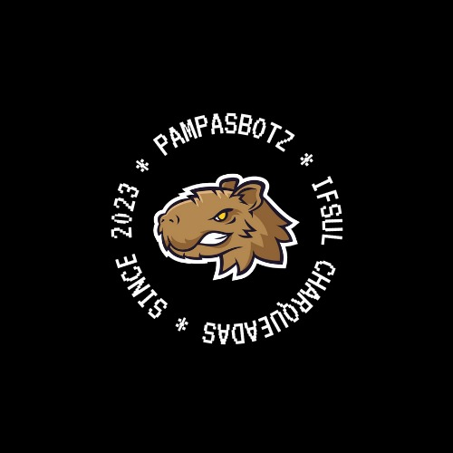
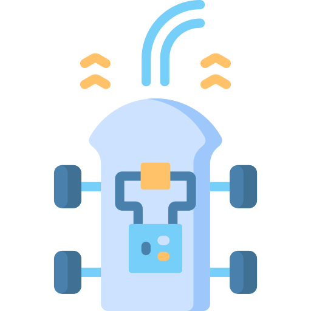

  <h1 align="center">PampasBotz</h1>

  

  <strong>Equipe de robótica móvel - IFSUL Campus Charqueadas</strong>

---

## Sobre Nós {#sobre-nos}

PampasBotz é uma equipe de robótica situada no IFSUL Campus Charqueadas.
Densenvolvemos projetos nas principais categorias de robótica móvel para participar das mais diversas competições da área.

## Categorias e robôs {#categorias-e-robos}

Abaixo estão as categorias em que competimos. Clique para conhecer os nossos robôs de cada categoria.

<table>
  <tbody>
    <tr>
      <td align="center">Seguidor de linha pró 
        &nbsp;&nbsp;&nbsp;&nbsp;&nbsp;
      </td>
      <td align="center">Sumô 500g 
        &nbsp;&nbsp;&nbsp;&nbsp;&nbsp;
      </td>
      <td align="center">Adicionar categoria 
        &nbsp;&nbsp;&nbsp;&nbsp;&nbsp;
      </td>
      <td align="center">Adicionar categoria 
        &nbsp;&nbsp;&nbsp;&nbsp;&nbsp;
      </td>
      <td align="center">Adicionar categoria 
        &nbsp;&nbsp;&nbsp;&nbsp;&nbsp;
      </td>
    </tr>
    <tr>
        <td></td>
        <td></td>
        <td></td>
        <td></td>
        <td></td>
    </tr>
  </tbody>
</table>

## 🤝 Integrantes {#integrantes}

<table>
  <tr>
    <td align="center">
      <a href="https://github.com/llucasrafaell">
         
        
          <b>Lucas Rafael</b>
        
      </a>
    </td>
     <td align="center">
      <a href="https://github.com/ETomacheski">
         
        
          <b>Eduardo Tomacheski</b>
        
      </a>
    </td>
  </tr>
  
</table>

## Contato {#contato}
### Clique na logo do Instagram para acessar nossa página

  

